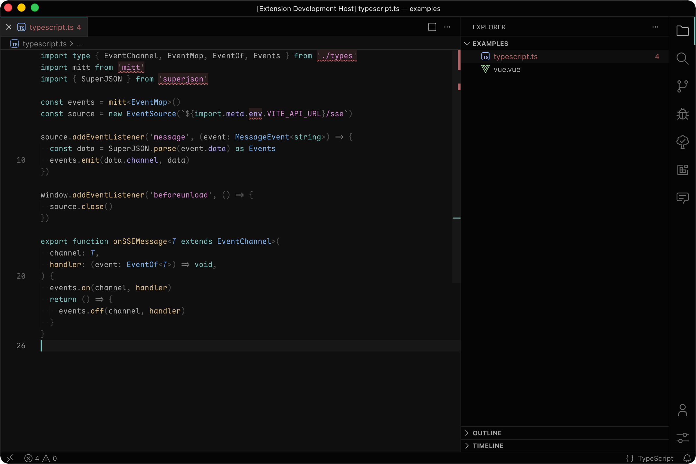

  The theme follows the quiet order of WCAG AA contrast, letting every word appear as clearly as ink in morning light. Its colors keep their gentle meanings, each shining in its own calm way without ever reaching for attention. The overall mood is pure and restrained—like a softly lit studio—unfolding a serene, steady space for long, contemplative hours of coding.

## Dark Theme Colors

Below are **all base colors** used throughout the **dark theme**, organized by color family and sorted accordingly. Each includes a visual color chip (via placehold.co) and descriptions of primary usage.

| Color Family | Color | Chip | Usage |
| ------------ | ----- | ---- | ----- |
| **Neutral Gray** | `#000000` |  | Pure black (used for invisible borders and shadows when combined with transparency) |
| **Neutral Gray** | `#050505` |  | Base background for panels, sidebar, terminal, widgets |
| **Neutral Gray** | `#0F0F0F` |  | Editor background, inputs, dropdowns, hover states |
| **Neutral Gray** | `#2D2D2D` |  | Selection backgrounds, blocks, badges |
| **Neutral Gray** | `#5F5F5F` |  | Borders, inactive UI, low‑contrast foreground |
| **Neutral Gray** | `#6C6C6C` |  | Placeholder text, de‑emphasized elements |
| **Neutral Gray** | `#8A8A8A` |  | Inactive foreground, icons, soft accents, editor line numbers |
| **Neutral Gray** | `#BCBCBC` |  | Primary text foreground |
| **Neutral Gray** | `#FFFFFF` |  | Maximum contrast highlights, focused text |
| **Blue-Cyan** | `#6AB8C0` |  | Regex highlighting, git renamed resources |
| **Blue-Cyan** | `#71A3EF` |  | Type parameters |
| **Blue-Cyan** | `#81D2CE` |  | Primary accent: cursor, borders, widgets, highlights, success states |
| **Blue-Cyan** | `#87C3FF` |  | Types, classes, interfaces, enums, info states, multi-cursor, charts blue |
| **Purple/Violet** | `#BBAAFF` |  | Properties, enum members, keys, symbols, charts purple |
| **Purple/Violet** | `#E394DC` |  | Strings, string literals |
| **Rose/Pink** | `#CC7C8A` |  | Language variables (this, self) |
| **Rose/Pink** | `#DD99AA` |  | Debug tokens, color symbols, blockquotes |
| **Warm Yellow/Orange** | `#DD9A6A` |  | Git conflicts, merge issues |
| **Warm Yellow/Orange** | `#E09B70` |  | React/JSX component names |
| **Warm Yellow/Orange** | `#E7D38F` |  | Warnings, decorators, inline values |
| **Warm Yellow/Orange** | `#EBC88D` |  | Functions, methods, numeric constants |
| **Green** | `#A8CC7C` |  | Directives, macros, CSS important, Go packages |
| **Red** | `#FF8787` |  | Error foregrounds, invalid tokens |
| **Terminal** | `#18191B` |  | Terminal ANSI Black |
| **Terminal** | `#EC5D6F` |  | Terminal ANSI Red |
| **Terminal** | `#E1465E` |  | Terminal ANSI Bright Red |
| **Terminal** | `#409D78` |  | Terminal ANSI Green |
| **Terminal** | `#169068` |  | Terminal ANSI Bright Green |
| **Terminal** | `#E5BF8C` |  | Terminal ANSI Yellow |
| **Terminal** | `#CD984D` |  | Terminal ANSI Bright Yellow |
| **Terminal** | `#4B8DEC` |  | Terminal ANSI Blue |
| **Terminal** | `#2A7DEB` |  | Terminal ANSI Bright Blue |
| **Terminal** | `#B174D9` |  | Terminal ANSI Magenta |
| **Terminal** | `#A660D4` |  | Terminal ANSI Bright Magenta |
| **Terminal** | `#82D2CE` |  | Terminal ANSI Cyan |
| **Terminal** | `#779E9E` |  | Terminal ANSI Bright Cyan |
| **Terminal** | `#C3C5C9` |  | Terminal ANSI White |
| **Terminal** | `#898E94` |  | Terminal ANSI Bright Black (Gray) |

## Color System Philosophy

The theme follows a structured opacity system applied to base colors to achieve depth, hierarchy, and subtle UI feedback.

| Opacity Token | Value            | Usage                                                           |
| ------------- | ---------------- | --------------------------------------------------------------- |
| **FF**        | 100%             | Primary UI surfaces, text, and strong contrast elements         |
| **E6**        | ~90%             | High-visibility accents, primary foregrounds                    |
| **CC**        | ~80%             | Hover states, secondary accents                                 |
| **B3**        | ~70%             | Subtle accents, warnings, info colors, and medium‑contrast text |
| **99**        | ~60%             | Operators, low‑emphasis elements                                |
| **80**        | ~50%             | Highlights, matches, subtle decorations                         |
| **66**        | ~40%             | Inlay hints, guides                                             |
| **4D**        | ~30%             | Borders, outlines                                               |
| **33**        | ~20%             | Highlight backgrounds, diff indicators                          |
| **1A**        | ~10%             | Very subtle backgrounds, ghost layers                           |
| **00**        | 0% (transparent) | Removing visual clutter or defining invisible boundaries        |

This system ensures **consistent luminance and contrast** while maintaining a quiet, Zen‑like environment.
