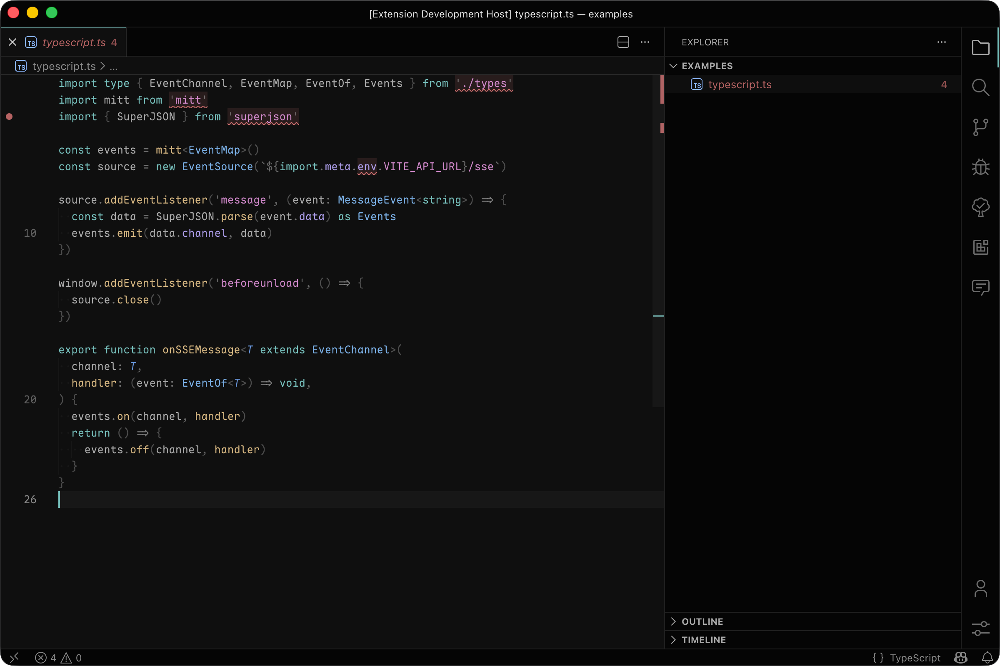
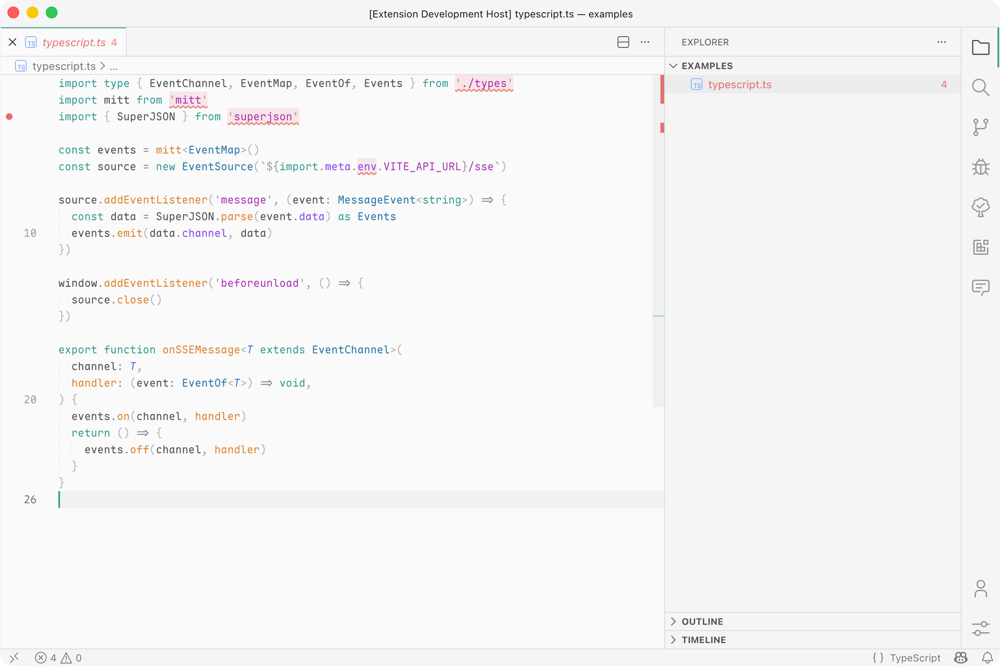

  Zen is a calm, Fleet-inspired theme for VS Code. It keeps contrast clear, state layers readable, and color roles restrained, so long editing sessions feel steady rather than noisy. Dark and light variants share the same design logic: quiet surfaces, consistent semantic hues, and interaction states that remain easy to distinguish.

## Design System

The repository-level color roles, palette inventory, opacity ladder, and editor-state hierarchy live in [DESIGN.md](./DESIGN.md).
If you are changing colors or reviewing consistency, start there instead of inferring intent from `themes/*.json`.

## Dark Theme

## Light Theme

